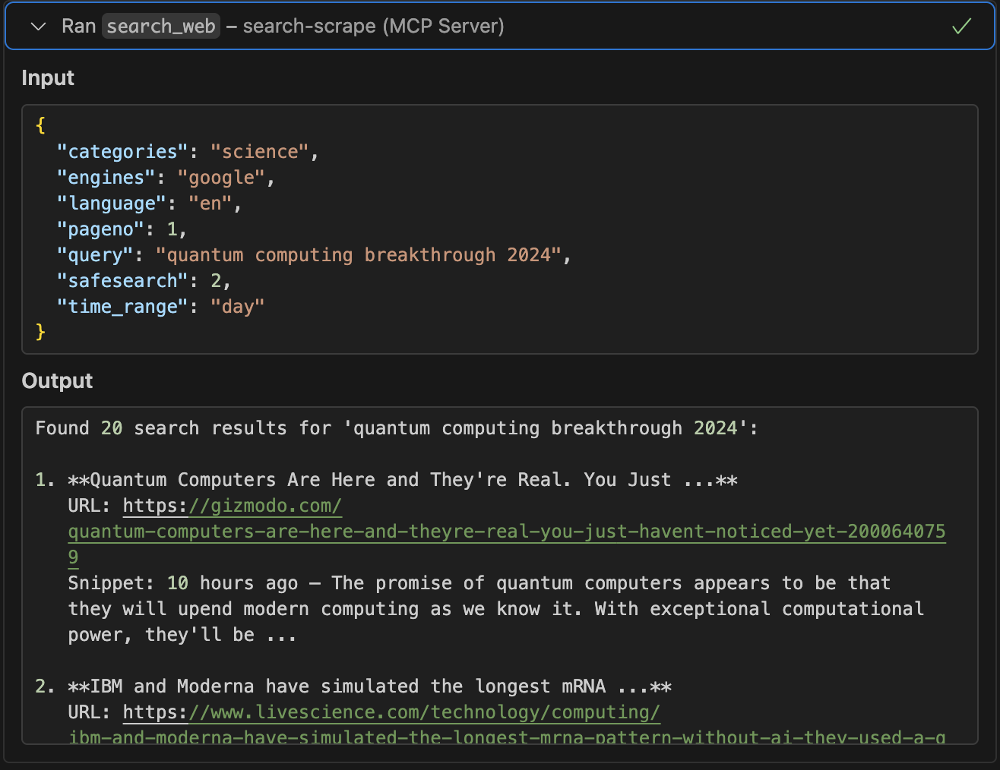
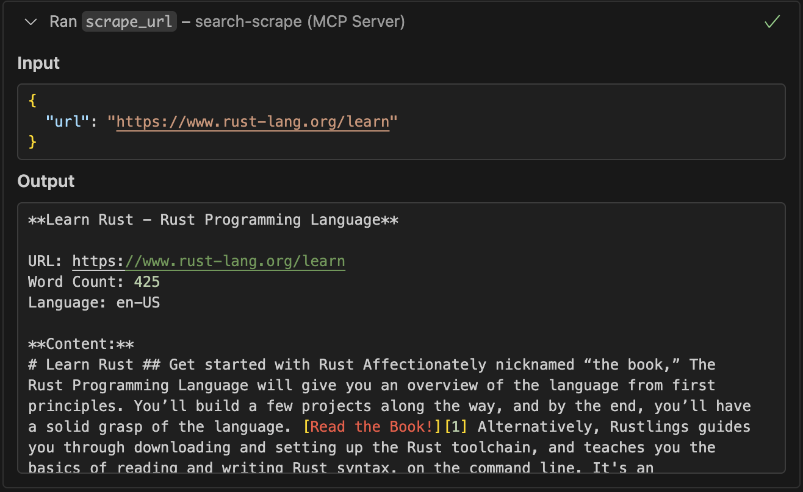

# Search-Scrape

**100% Free** web search and scraping MCP tools for AI assistants. No API keys, no costs, no limits.

## ✨ Features

- 🔍 **Advanced Search**: Full SearXNG parameter support (engines, categories, language, safesearch, time_range)
- 🕷️ **Optimized Scraping**: Intelligent content extraction with noise filtering and ad removal
- 🔧 **Native MCP Tools**: Direct integration with VS Code, Cursor, and other AI assistants
- 💰 **100% Free**: No API keys or subscriptions required
- 🛡️ **Privacy First**: All processing happens locally

### 📸 Screenshot

Here are screenshots showing the MCP tools working in Vscode, Cursor, Trae:

#### Search Web Tool


#### Scrape URL Tool  


## 🚀 Quick Start

```bash
# 1. Start SearXNG search engine
docker-compose up searxng -d

# 2. Build MCP server
cd mcp-server && cargo build --release

# 3. Add to your AI assistant's MCP config:
{
  "mcpServers": {
    "search-scrape": {
      "command": "/path/to/mcp-server/target/release/mcp-stdio",
      "env": { "SEARXNG_URL": "http://localhost:8888" }
    }
  }
}
```

## � MCP Tools

### `search_web` - Advanced Web Search
**Enhanced with full SearXNG parameter support:**
- **engines**: `google`, `bing`, `duckduckgo`, etc.
- **categories**: `general`, `news`, `it`, `science`, etc.
- **language**: `en`, `es`, `fr`, `de`, etc.
- **safesearch**: `0` (off), `1` (moderate), `2` (strict)
- **time_range**: `day`, `week`, `month`, `year`
- **pageno**: Page number for pagination

```json
{
  "query": "rust programming",
  "engines": "google,bing",
  "categories": "it,general",
  "language": "en",
  "safesearch": 1,
  "time_range": "month"
}
```

### `scrape_url` - Optimized Content Extraction
**Intelligent scraping with advanced cleanup:**
- ✅ Removes ads, navigation, and boilerplate content
- ✅ Extracts clean article text and structured data
- ✅ Preserves headings, lists, and important formatting
- ✅ Handles documentation sites (mdBook, GitBook, etc.)
- ✅ Fallback extraction methods for difficult sites

```json
{
  "url": "https://doc.rust-lang.org/book/ch01-00-getting-started.html"
}
```

## 🛠️ Development

```bash
# Test search with parameters
curl -X POST "http://localhost:5000/search" \
  -H "Content-Type: application/json" \
  -d '{"query": "AI", "engines": "google", "language": "en"}'

# Test optimized scraping
curl -X POST "http://localhost:5000/scrape" \
  -H "Content-Type: application/json" \
  -d '{"url": "https://example.com"}'
```

## 📁 Project Structure

```
├── mcp-server/           # Native Rust MCP server
│   ├── src/
│   │   ├── search.rs     # SearXNG integration with full parameter support  
│   │   ├── scrape.rs     # Optimized content extraction
│   │   └── rust_scraper.rs # Advanced cleaning & noise filtering
│   └── target/release/   # MCP binaries
├── searxng/             # SearXNG configuration
└── docker-compose.yml   # Container orchestration
```
